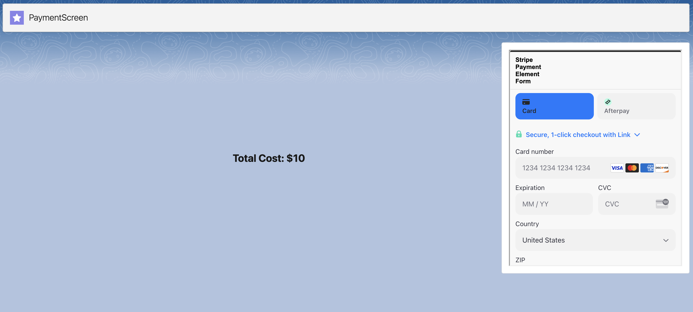

# Collect Payments with Stripe From a Lightning Web Component

## Description
This package is an example of how you can collect payments from a Salesforce LWC with Stripe. The package uses a simple LWC and an iframed visual force page to collect payment via [Stripe Payment Elements](https://stripe.com/docs/payments/payment-element)

File Structure
```
├── force-app/main/default
│   ├── classes
│   │   ├── stripePayment.cls
|   |   |   - APEX class to create paymentIntent
|   |   ├── lwc/lightningPayment
|   |   |   ├── lightningPayment.html
|   |   |   - Web Page for the lwc calles the iframe
|   |   |   ├── lightningPayment.js
|   |   |   - Calls the stripePayment.cls to create a PaymentIntent
|   |   |   - And Passes client sec and pk_key to the StripePaymentPage.page
|   |   |   ├── lightningPayment.css
│   |   ├── pages
│   │   |   ├── StripePaymentPage.page
|   |   |   - VisualForce page used to draw the Payment Element, calls both the 
|   |   |   - static resource StripePaymentElement.js as well as loads StripeJS
│   |   ├── Staticresources
│   |   |   ├──  StripePaymentElement.js
|   |   |   - Creates Payment Element and loads it in the VisualForce page.               
```
## Overview

This Example code provides a LWC Called lightningPayment and can be added to a custom Lightning app.



## Run the sample locally

_This example can be installed locally
configuration will vary depending on your salesforce environment._

### Requirements

- **A Stripe account**: You can sign up for a Stripe account here: https://dashboard.stripe.com/register
- **A Salesforce Org**: You can register for a Salesforce account here: https://developer.salesforce.com
- **Stripe Universal Connector v1.9+ [Installed and Configured](https://docs.google.com/document/d/1CY_rppxQaN-k9mTfm-Tqy8wnWGfXDWVEFNCBri_SjuQ/edit?usp=share_link)**: Register for the connecrtor here: https://stripe.com/docs/plugins/stripe-connector-for-salesforce/overview

### Installing the example

To download a Salesforce project from GitHub and deploy it into a Dev or Scratch org, follow these steps:

1. Clone the GitHub repository that contains the Salesforce project you want to download onto your local machine using the git clone command. 
```sh
git clone https://github.com/stripe/salesforce-connector-examples.git
```

2. Once the repository is cloned, navigate to the root directory of the example in the command line interface.
```sh
mkdir salesforce-connector-examples
cd salesforce-connector-examples
```

3. Authenticate into your Salesforce Instance
```sh
sfdx auth:web:login -d -a MySFInstance
```

4. Modify the lightningPayment.js file to meet your environment requirments and permissions. There are variable placeholders tht will need updated. 
For Example: 
```java
    @track totalCost = 10.00;  // Example value for total
    @track stripeCustomerId = 'cus_ON5ZggzrFQ'; //Example this is the stripe customerId
    @track orderId = 'order_0001'; //Example orderID
    @track stripeAccountRecordID = 'a027g0000AAK' //Example recordID of the stripeGC.Stripe_Account
    @track stripeOnbehalfAccount = 'acct_1NdIVaFKXD' //Example Connect Stripe Account Id from Stripe Dashboard
    @track currency = 'usd' //Example currency to pass
    @track clientSec;
    @track pk_key = 'pk_test_SB3lf48h86WTFN'; //Public Key For main Stripe account
```

5. Deploy the example app to your SF Instance:
```sh
sfdx deploy
```

## Author(s)

- [@millin-stripe](https://github.com/millin-stripe)
